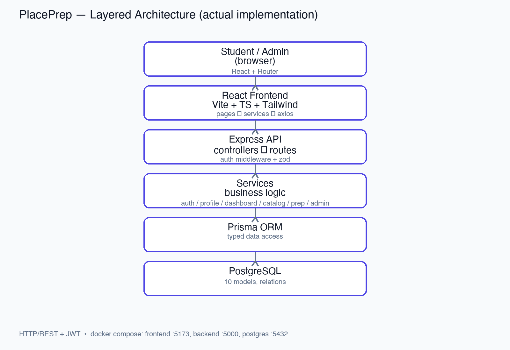

# PlacePrep

> A modern placement preparation platform for college students.

---

# Vision Document

## Project Overview

PlacePrep is a centralized placement preparation platform designed to help students prepare for campus recruitment through coding practice, aptitude preparation, company-specific preparation, resume management, and personalized progress tracking.

Instead of switching between multiple websites and tools, students can access everything they need from one modern, organized platform.

---

## Problem Statement

Students preparing for campus placements often rely on multiple disconnected platforms for:

- Coding practice
- Company interview experiences
- Aptitude preparation
- Resume analysis
- Progress tracking

Managing these resources separately makes preparation inefficient and difficult to monitor.

PlacePrep solves this problem by providing a single platform where students can organize, prepare, and track every aspect of their placement journey.

---
## Software Design 
PlacePrep follows a layered client-server architecture with a React + TypeScript frontend and a Node.js + Express + TypeScript backend. The backend separates routes, middleware, controllers, services, and Prisma-based database access over PostgreSQL. The design emphasizes abstraction, modularity, high cohesion, low coupling, and separation of concerns. Major design decisions include React + TypeScript for maintainable UI development, a layered backend for responsibility separation, PostgreSQL + Prisma for relational data management, JWT + RBAC for protected role-based functionality, and Docker Compose for a consistent development environment.

### Architecture 
 Editable architecture source: `docs/design/architecture.drawio` 

### Design Documentation 
Design artifacts and UI screenshots are available under: `docs/design/`

## Target Users

### Primary Persona – Placement Aspirant

- Undergraduate engineering student
- Preparing for internships and campus placements
- Needs structured preparation resources
- Wants to monitor preparation progress

### Secondary Persona – Final Year Student

- Applying to multiple companies
- Needs company-specific preparation
- Wants resume management and interview readiness tracking

---

## Vision Statement

> To provide students with a centralized, modern, and scalable placement preparation platform that simplifies learning, tracks progress, and improves placement readiness.

---

# Key Features

### Authentication

- User Registration
- Secure Login
- JWT Authentication
- Protected Routes

### Dashboard

- Personalized Welcome
- Progress Overview
- Statistics Cards
- Recent Activity
- Quick Actions

### Company Preparation

- Company Listings
- Search & Filters
- Eligibility Criteria
- Salary Package
- Recruitment Process
- Interview Rounds
- Important Topics
- Preparation Resources
- Tips

### Coding Practice

- Problem Library
- Search & Filters
- Difficulty Levels
- Tags
- Bookmark Problems
- Mark Problems as Solved

### Aptitude Preparation

- Multiple Categories
- Timed Quiz Interface
- Score Tracking
- Progress Tracking

### Resume Module

- Resume Upload
- Resume History
- Resume Preview
- Mock ATS Score
- Resume Suggestions
- Missing Skills Analysis

### Profile

- Student Information
- Academic Details
- Skills
- Social Links

### Settings

- Theme Preference
- Notification Preferences
- Password Update

---

# Success Metrics

The project will be considered successful if users can:

- Register and log in successfully
- Access a personalized dashboard
- Browse company preparation material
- Practice coding questions
- Attempt aptitude quizzes
- Upload resumes
- View resume analysis
- Track preparation progress

---

# Assumptions

- Users are college students preparing for placements.
- Internet connectivity is available.
- Resume analysis is rule-based (no external AI integration in the MVP).
- Company and coding datasets are pre-seeded.

---

# Constraints

- Developed using technologies approved for the course.
- PostgreSQL is the primary database.
- JWT is used for authentication.
- AI modules are prepared for future implementation.

---

# Technology Stack

## Frontend

- React
- Vite
- TypeScript
- Tailwind CSS
- React Router
- Axios

## Backend

- Node.js
- Express
- TypeScript

## Database

- PostgreSQL
- Prisma ORM

## Authentication

- JWT
- bcrypt

## Development

- Docker
- Docker Compose
- Git
- GitHub

---

# Project Structure

```text
placeprep/
├── frontend/
│   ├── src/
│   ├── public/
│   └── Dockerfile
│
├── backend/
│   ├── src/
│   │   ├── config/
│   │   ├── controllers/
│   │   ├── middleware/
│   │   ├── repositories/
│   │   ├── routes/
│   │   ├── services/
│   │   ├── utils/
│   │   └── validations/
│   ├── prisma/
│   └── Dockerfile
│
├── prisma/
│
├── docs/
│   ├── architecture/
│   ├── wireframes/
│   └── screenshots/
│
├── compose.yaml
├── .dockerignore
├── .gitignore
└── README.md
```

---

# System Architecture

```text
Student
    │
    ▼
React Frontend
    │
REST API (Axios)
    │
Express Backend
    │
Business Services
    │
Repositories
    │
Prisma ORM
    │
PostgreSQL Database
```

---

# Git Branching Strategy

This project follows **GitHub Flow**.

### Main Branch

```
main
```

Contains stable and deployable code.

### Feature Branches

Each feature is developed independently before merging into **main**.

Examples:

```
feature/authentication

feature/dashboard

feature/company-module

feature/coding-module

feature/resume-module
```

### Workflow

```text
main
   │
   ▼
Create Feature Branch
   │
   ▼
Develop Feature
   │
   ▼
Commit Changes
   │
   ▼
Create Pull Request
   │
   ▼
Code Review
   │
   ▼
Merge into main
```

---

# Local Development Tools

- Visual Studio Code
- Git
- GitHub
- Docker Desktop
- Node.js
- npm
- PostgreSQL
- Prisma ORM

---

# Quick Start – Local Development

## Clone Repository

```bash
git clone <repository-url>

cd placeprep
```

## Start the Application

```bash
docker compose up --build
```

Docker Compose starts:

- Frontend Container
- Backend Container
- PostgreSQL Database

---

## Application URLs

Frontend

```
http://localhost:5173
```

Backend

```
http://localhost:5000
```

PostgreSQL

```
localhost:5432
```

---

# Docker

Docker is used to create a consistent local development environment.

Containers included:

- Frontend
- Backend
- PostgreSQL

Managed using:

```
compose.yaml
```

---

# Current Development Status

### Completed

- Project Planning
- Vision Document
- Technology Stack Selection
- GitHub Repository Setup
- Folder Structure
- Architecture Design
- Docker Configuration
- Local Development Environment

### In Progress

- Authentication Module
- Dashboard
- Backend API
- Database Schema

### Planned

- Company Preparation Module
- Coding Practice Module
- Aptitude Module
- Resume Management
- Profile Module
- Settings Module

---

# Review 1 Deliverables

## Repository

- Vision Document (README)
- Organized Folder Structure
- GitHub Repository
- GitHub Flow Branching Strategy
- Docker Setup
- Local Development Instructions

## Software Engineering Artifacts

- Architecture Diagram (Draw.io)
- 25 User Stories (GitHub Projects & Issues)
- MoSCoW Prioritization
- Figma Wireframes (6 Screens)

---

# Screenshots

The following screenshots will be included as development progresses:

- GitHub Repository
- Repository Branches
- README Preview
- Docker Build
- Docker Compose Running
- Application Running on Localhost
- Landing Page
- Dashboard

All screenshots will be stored in:

```text
docs/screenshots/
```

---

# Future Scope

- AI Resume Analysis
- AI Interview Assistant
- Mock Interview System
- Study Planner
- Company Recommendation Engine
- Notifications
- Roadmaps
- Leaderboards
- Analytics Dashboard
- Admin Panel

---

# Contributors

- Suraj R (24BPS1131)
- Devananda P (24BDS1130)

---

# License

This project is developed for academic purposes as part of the Software Engineering course.
